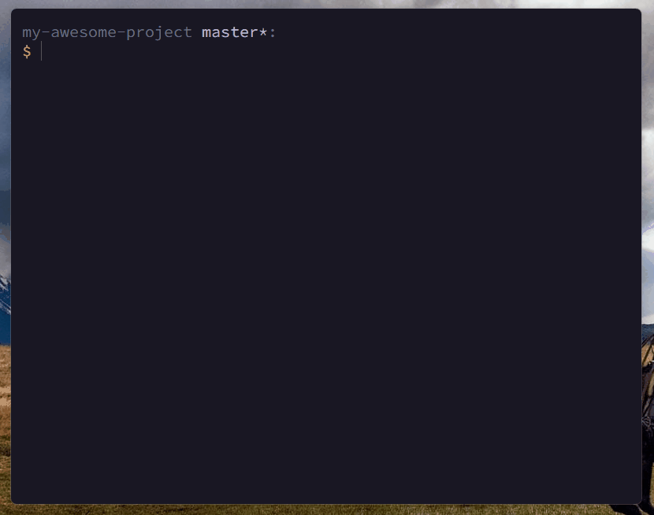

<p align="center"></p>

<p align="center">
<strong>
🔎 <code>coco</code> is an interactive <i>command line interface</i> for creating <a href="https://www.conventionalcommits.org/">conventional commits.</a>
</strong>
</p>

<br/>

<p align="center"></p>

   # `coco` › [![LICENSE_BADGE][LICENSE_BADGE]][LICENSE_LINK] [![NPM_BADGE][NPM_BADGE]][NPM_LINK] [![ISSUES_BADGE][ISSUES_BADGE]][ISSUES_LINK]

## Installation

```bash
npm install -g @lucas-labs/coco
```

## Usage

```bash
$ coco

# and follow the steps 😊
```

## Configuration

`coco` can be configured by creating a `coco.yaml`, `coco.yml` or `.cocorc` file in your project's root (per repository config) or in your users home directory (global config). The file should be a valid YAML:

### Options
#### `types`
An array of commit types. Each type should be an object with the following properties: 
 * `name` - The name of the type
 * `desc` - The description of the type
 * `emoji` - The emoji to be used for the type if `useEmoji` is set to `true`

```yaml
types:
  - name: feat
    desc: A new feature
    emoji: 🎉
  - name: fix
    desc: A bug fix
    emoji: 🐛
```

#### `scopes`
An array of commit scopes. 

```yaml
scopes:
  - api
  - ui
```

#### `useEmoji`
Whether to use emojis for the commit type. If set to `true`, the `emoji` property of the type will be used to create the commit message. 

```yaml 
useEmoji: true
```
Provided useEmoji is `true`, an example of a commit message would be: `feat(api): ✨ add new endpoint`

#### `askScope`
Whether to ask for the scope of the commit. IF set to `true`, the user will be prompted to enter or select a scope (depending if scope list was provided by user config or not). If set to `false`, the scope will be omitted from the commit message and the cli won't ask for it.

```yaml
askScope: true
```

#### `askBody`
Whether to ask for the body of the commit. If set to `true`, the user will be prompted to enter the body of the commit. If set to `false`, the body will be omitted from the commit message and the cli won't ask for it.

```yaml
askBody: true
```

#### `askFooter`
Whether to ask for the footer of the commit. If set to `true`, the user will be prompted to enter the footer of the commit. If set to `false`, the footer will be omitted from the commit message and the cli won't ask for it.

```yaml
askFooter: true
```

#### `askBreakingChange`
Whether to ask for the breaking change of the commit. If set to `true`, the user will be prompted to enter the breaking change of the commit. If set to `false`, the breaking change will be omitted from the commit message and the cli won't ask for it.

```yaml
askBreakingChange: true
```


### Example
```yaml
types:
  - name: feat
    desc: A new feature
    emoji: 🎉
  - name: fix
    desc: A bug fix
    emoji: 🐛

scopes:
   - api
   - ui

useEmoji: true
askFooter: false
```

## License
MIT © 2022 [Lucas Labs](https://lucaslabs.tech)

  [LICENSE_LINK]:    https://github.com/lucas-labs/coco/blob/master/LICENSE.md
  [LICENSE_BADGE]:   https://img.shields.io/github/license/lucas-labs/coco?color=005af0&style=flat-square

  [NPM_LINK]:        https://www.npmjs.com/package/@lucas-labs/coco
  [NPM_BADGE]:       https://img.shields.io/npm/v/@lucas-labs/coco?color=d400b6&style=flat-square
  
  [ISSUES_LINK]:     https://github.com/lucas-labs/coco/issues
  [ISSUES_BADGE]:    https://img.shields.io/github/issues-raw/lucas-labs/coco?color=1ed760&style=flat-square